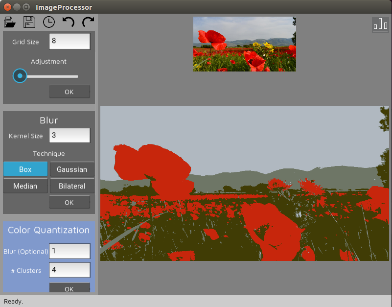
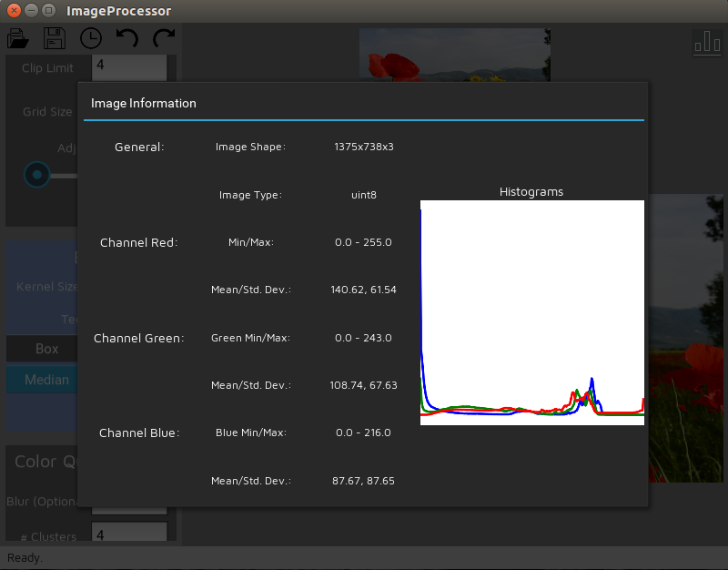
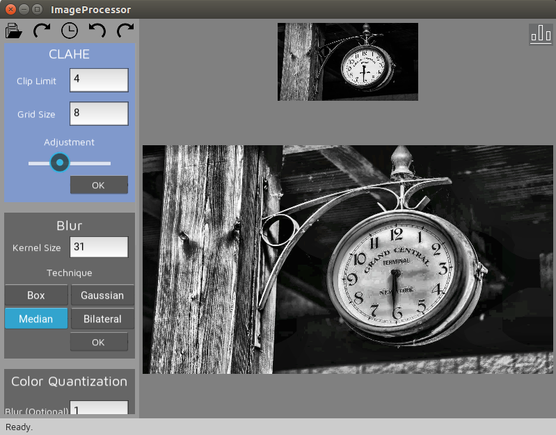

# ImageProcessor
Image processing functions in an intuitive GUI

Current Tools:

<b>CLAHE (Contrast Limited Adaptive Histogram Equalization):</b>  
Parameters: Clip Limit, Grid Size  
Description: Use OpenCV's CLAHE algorithm as depicted in https://docs.opencv.org/3.1.0/d5/daf/tutorial_py_histogram_equalization.html  

<b>Blur:</b>  
Parameters: Kernel Size, Blur Type (Box, Gaussian, Median, Bilateral)  
Description: Use the blur functions from OpenCV: https://docs.opencv.org/3.1.0/d4/d13/tutorial_py_filtering.html  
 
<b>Color Quantization:</b>  
Parameters: Blur Kernel Size (Optional), Number of Clusters  
Description: Perform a k-means clustering of the image colors. Can optionally perform a median blur first on the image, to get a smoother clustering.  

<b>Detail Inpainting:</b>  
Parameters: Blur Kernel Size, Dilation size  
Description: Creates a mask from the image details, and the INPAINT_TELEA algorithm to fill in the blanks. https://docs.opencv.org/3.4.0/df/d3d/tutorial_py_inpainting.html  

